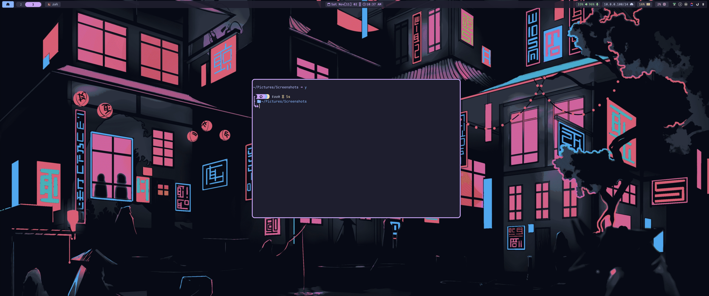
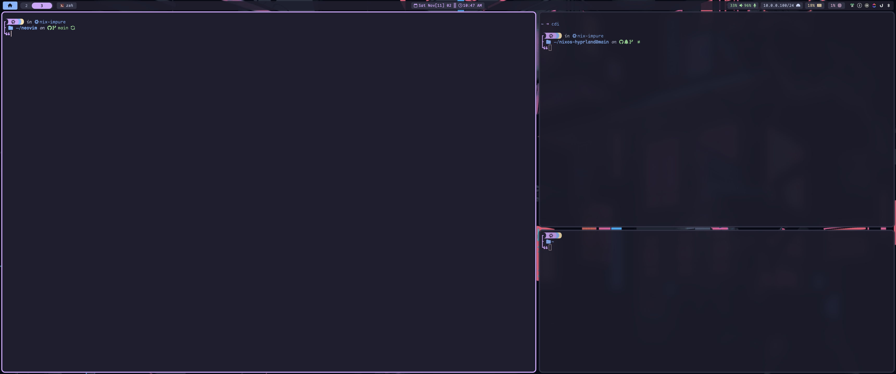
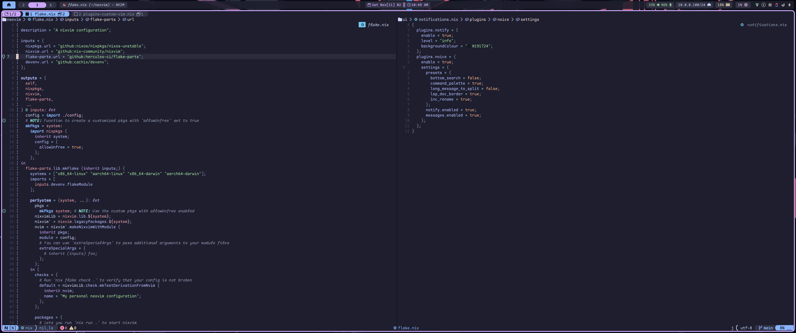
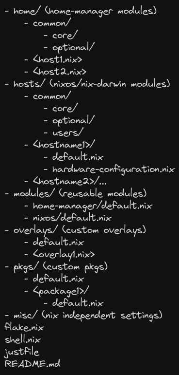

<!-- markdownlint-disable -->
<h1 align="center">
    <a>
        MrGeoTech's NixOS Config
    </a>
</h1>
<div align="center">
    <sup>
        <a href="https://nixos.org"></a>
    </sup>
        <br/>
        <sub>
            <a href="https://nixos.org/manual/nix/stable/language/index.html" target="_blank">
            
            </a>
            <a href="https://nixos.wiki/wiki/Flakes" target="_blank">
            
            </a>
            <a href="https://github.com/nix-community/home-manager" target="_blank">
            
            </a>
        </sub>
    </div>
</div>

<div align="center">
    Dotfiles for my <a href="https://hyprland.org">Hyprland</a> setup on my <a href="https://nixos.org">NixOS</a> system.
    <br/>
    <p><strong>Be sure to <a href="#" title="star">⭐️</a> or <a href="#" title="fork">🔱</a> this repo if you find it useful! 😃</strong></p>
</div>
<!-- markdownlint-restore -->

## Setup

- OS: [NixOS](https://nixos.org)
- Window manager: [Hyprland](https://hyprland.org)
- Status bar: [Waybar](https://github.com/Alexays/Waybar)
- Terminal: [Kitty](https://sw.kovidgoyal.net/kitty/)
- Shell: [Zsh](https://www.zsh.org/)
- Current theme: [Catppuccin](https://catppuccin.com/)
- Font: [Iosevka/IosevkaTerm](https://typeof.net/Iosevka/)
- Editor: [Neovim](https://neovim.io)
- File Sync: [Rsync](https://rsync.samba.org/)

## Gallery

|             Desktop              |
| :------------------------------: |
|  |

|              Terminal + Tmux              |
| :---------------------------------------: |
|  |

|             Neovim             |
| :----------------------------: |
|  |

## Organization of the modules



## Sandboxed, on-demand apps

The base system -- browser (Vivaldi), file manager (Yazi), desktop
(Hyprland), terminal (Ghostty), editor (Neovim) -- is configured and
installed the normal home-manager way, same as always.

Everything else that's more of an occasional tool than a daily driver
(compilers, IDEs, CAD/office/media apps, ...) is wrapped instead: see
`home/common/lib/sandbox-apps.nix` and its use in
`home/common/optional/apps/default.nix`. Each wrapped command is a small
script that runs `nix shell nixpkgs#<pkg> --command <bin> "$@"`, so the
actual package is only fetched/built the first time you run it, and isn't
part of every home-manager generation.

Any command that isn't installed at all gets searched automatically: the
shell's `command_not_found_handle`/`command_not_found_handler` (see
`home/common/core/shells/{bash,zsh}.nix`) forwards it to
[`comma`](https://github.com/nix-community/comma), backed by a prebuilt
[nix-index-database](https://github.com/nix-community/nix-index-database)
so no local index needs to be built. It only runs interactively (a real
terminal, `COMMA_ASK_TO_CONFIRM=true` set in `home/common/core/default.nix`
makes it confirm before running anything), and the mistyped/unknown
command is only ever passed through as an argument, never interpolated
into a shell string.

## Installation

#### Requirements

- NixOS (I use 24.11)
- Disk space
- Patience
- Knowledge
- Stubborness

#### Installation 
```sh
# -- If you are me --
mkdir ~/Desktop
mkdir ~/Documents
mkdir ~/Downloads
mkdir ~/Pictures
mkdir ~/Projects
mkdir ~/School
mkdir ~/Videos
# -------------------
cd /etc/nixos/
sudo nixos-rebuild switch --flake '.#<host>'
```
> You will also have to copy over ~/.ssh and ~/.secrets
## Acknowledgements

- [Dileep Kishore's nix config](https://github.com/dileep-kishore/nixos-hyprland) The framework my NixOS distro is based off of
- [EmergentMind's nix config](https://github.com/EmergentMind/nix-config): Structure, reference and some documentation
- [Misterio77's nix config](https://github.com/Misterio77/nix-config): Structure and reference
- [VimJoyer](https://github.com/vimjoyer): Whose YouTube videos aided me in beginning with Nix and persevering through challenges
